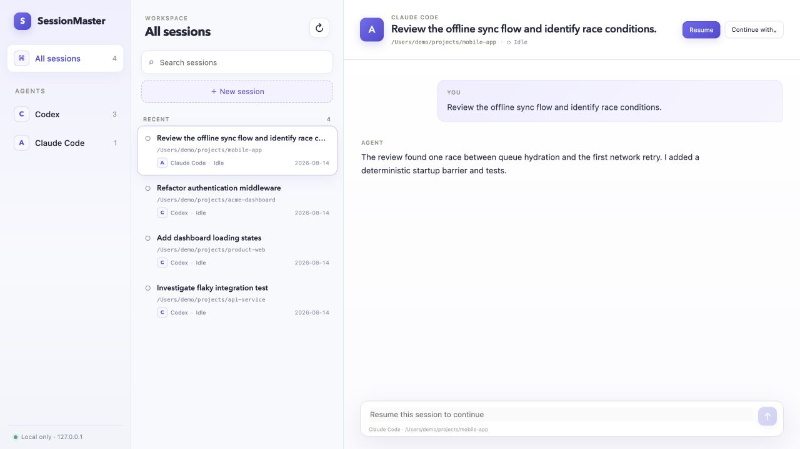

# SessionMaster

**English** | [简体中文](README.zh-CN.md)

**A local-first web workspace for all your AI coding sessions.**

SessionMaster brings Codex and Claude Code into one calm, searchable interface without replacing either CLI. It discovers native session history, shows structured conversations and tool activity, and lets you start, resume, continue, or stop managed sessions from the browser.

Everything runs locally. Native histories remain the source of truth, the server binds to `127.0.0.1`, and no hosted SessionMaster service is required.



> The screenshot uses isolated demo data. No local session content is included in this repository.

## Why SessionMaster

AI coding tools are excellent at working inside a project, but their sessions quickly become fragmented across terminal windows, history files, and different CLIs. SessionMaster adds the missing coordination layer:

- one inbox for sessions from multiple coding agents;
- clear running, waiting, completed, and failed states;
- searchable history across projects and conversations;
- structured visibility into messages, commands, tool calls, and permissions;
- explicit cross-agent handoff without pretending it is a native resume.

SessionMaster is not a new coding agent, an IDE, or a proxy that hides which backend owns a session.

## Features

### Unified local session inbox

- Discovers native Codex and Claude Code history without modifying it.
- Groups sessions into **Needs attention**, **Running**, and **Recent**.
- Filters by backend and searches titles, projects, paths, and message history.
- Shows exact session dates and the originating agent for every item.
- Refreshes native history on demand with visible progress and completion feedback.

### Structured conversation view

- Renders user and assistant messages as readable conversation blocks.
- Displays commands, terminal output, reasoning, tool calls, tool results, and errors.
- Keeps long JSON, logs, and command output contained within the conversation layout.
- Streams managed runtime updates to the UI over WebSocket.

### Managed runtime control

- Starts new Codex or Claude Code sessions in an existing local project directory.
- Resumes native sessions using each backend's supported protocol.
- Sends follow-up messages to runtimes launched or resumed by SessionMaster.
- Surfaces permission requests with explicit approve and reject actions.
- Stops a runtime only after the backend process has actually exited. It first requests graceful termination, escalates when necessary, and keeps the session running if exit cannot be confirmed.

### Cross-agent continuation

Use **Continue with** to create a new session on another backend. SessionMaster builds a bounded handoff from recent conversation context and records the relationship between the original and continued sessions. The new session is clearly labelled as a continuation rather than a native resume.

## Supported backends

| Capability | Codex | Claude Code |
|---|---:|---:|
| Executable detection | ✓ | ✓ |
| Native history discovery | ✓ | ✓ |
| Structured history | ✓ | ✓ |
| Start managed session | ✓ app-server | ✓ stream-json |
| Native resume | ✓ app-server | ✓ `--resume` |
| Live structured events | ✓ | ✓ |
| Follow-up messages | ✓ | ✓ |
| Permission approve/reject | ✓ | ✓ |
| Confirmed process stop | ✓ | ✓ |
| Cross-agent context handoff | ✓ | ✓ |
| Attach arbitrary existing terminal | — | — |

Capabilities are measured at startup. A broken or unavailable adapter does not prevent the other backend from working.

ZCode is intentionally outside the current release scope.

## Requirements

- Node.js 22.13 or newer
- pnpm 10+
- Codex and/or Claude Code installed and authenticated locally

SessionMaster checks the Codex binary bundled with the macOS ChatGPT app before common CLI locations. Claude Code is detected in common Homebrew and local installation paths.

## Quick start

```bash
git clone https://github.com/hkcao/SessionMaster.git
cd SessionMaster
pnpm install
pnpm build
pnpm start
```

Open [http://127.0.0.1:4310](http://127.0.0.1:4310).

For development:

```bash
pnpm dev
```

The Vite frontend runs at `http://127.0.0.1:4311` and proxies API and WebSocket traffic to the local service on port 4310.

## Architecture

SessionMaster is a TypeScript and pnpm monorepo:

```text
apps/
  server/          Fastify REST/WebSocket API and local SQLite index
  web/             React and Vite user interface
packages/
  core/            Shared session, runtime, event, and adapter contracts
  adapter-codex/   Codex history and app-server integration
  adapter-claude/  Claude Code history and stream-json integration
```

The core registry isolates backend failures and exposes a shared capability model. Adapters normalize native history and live protocol events into a common event stream, while preserving backend identity and native session IDs.

See [docs/architecture.md](docs/architecture.md) for the domain model and protocol flow.

## Local data and security

- Native histories remain under `~/.codex` and `~/.claude`.
- SessionMaster stores its local index and continuation relationships in `.session-master/session-master.sqlite`.
- The server listens on localhost by default.
- Permission requests are never auto-approved.
- Authentication files, environment variables, API keys, and tokens are not indexed.
- Only runtimes launched or resumed through SessionMaster can be controlled. Arbitrary existing terminal processes are deliberately not attached.

## Validation

```bash
pnpm test
pnpm typecheck
pnpm build
```

The test suite covers core registry behavior, adapter normalization, session discovery and filtering, immediate runtime visibility, confirmed-stop state cleanup, idempotent repeated stops, and preservation of running state when backend termination fails.

## Current limitations

- The current interface is optimized for desktop-sized local browsers.
- Attaching to arbitrary existing PTYs or terminal windows is not supported.
- Runtime control is available only for sessions started or resumed by SessionMaster.
- ZCode support has not been implemented yet.
